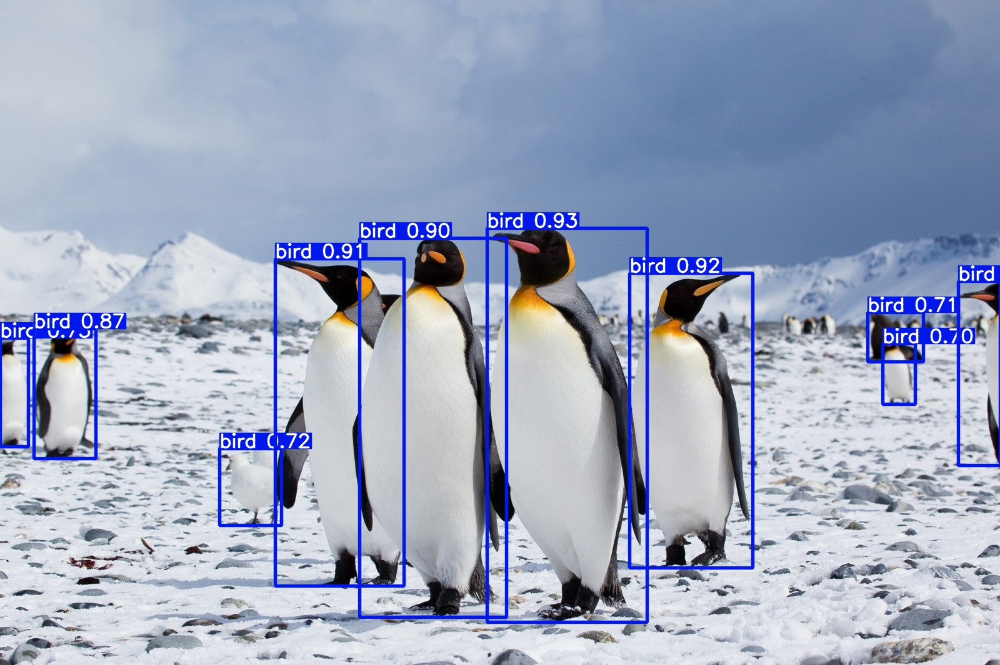

# Antarctic Vision: Penguin Detection with YOLOv5

Computer vision project (with Bentley Barth, University of Victoria) to detect penguins in Antarctic imagery and video, regardless of their size or orientation, using YOLOv5.

[](https://youtu.be/zA6IwMAYqpI)

▶️ **[Watch the demo video](https://youtu.be/zA6IwMAYqpI)**

## Approach

**1. Pre-trained models.** YOLOv5's pre-trained COCO models handled object detection and pixel-level instance segmentation on penguin images and video, which produced the demo video. They were accurate (detections above 70% confidence) but could only label penguins as generic "birds."

**2. Custom dataset model.** To detect penguins specifically, we built a custom dataset in Roboflow: 1,600 annotated and augmented penguin images, sourced from Google's Open Images V7, plus rock and iceberg datasets. We then trained our own YOLOv5 detector in Google Colab. Training on a single T4 GPU meant tuning image size, batch size, and epochs to work within those compute limits.

## Results

- The custom model correctly identified penguins instead of mislabelling them as "birds".
- Precision reached 1.0 at a 0.94 confidence threshold.
- Precision across the precision-recall curve was about 75%.

## Files

| File | Contents |
| --- | --- |
| `penguin_detection.ipynb` | Colab notebook: environment setup, pre-trained detection and segmentation, Roboflow dataset import, training, TensorBoard, and inference |
| `Antarctic_Vision_Report.pdf` | Full project report |

## Running the notebook

Open it in Google Colab with a GPU runtime. The dataset cells use the Roboflow API, so set your own key first:

```python
import os
os.environ["ROBOFLOW_API_KEY"] = "your-key-here"
```

## Authors

**Benjamin Philipenko** · [benphilipenko.ca](https://benphilipenko.ca/penguin-detection) and Bentley Barth
